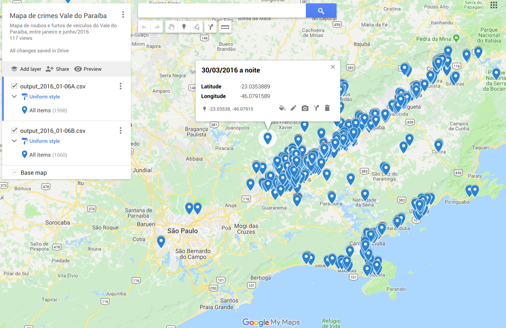

# Visualization of vehicle robbery and theft in part of São Paulo state, Brazil

This short project aims at visualizing the spatial distribution of vehicle robbery and theft in the Vale do Paraiba region of São Paulo state, Brazil. Only events occured between January and June 2016 will be considered, however the methodology can be easily extended to any other date range or location in São Paulo state. Public government data is used in this project, data parsing is done by Python and visualization is made through Google MyMaps. The event location address is converted to latitude/longitude information (geotagging) using the Google Maps API.

## Data extraction

The public data information can be found [here](http://www.ssp.sp.gov.br/transparenciassp/Consulta.aspx), at the Data Transparency website of São Paulo state Public Security Bureau. The data used in this study can be reproduced by exporting *"furto de veículo"* (vehicle theft) and *"roubo de veículo"* (vehicle robbery). The department considered was *"DEINTER 1 - SAO JOSE DOS CAMPOS"*.

Data could be scrapped automatically using a scrapper tool such as Selenium (working directly with a tool such as BeautifulSoup would not work because the website is written in JavaScript), however it was decided to manually download the data for each month, due to the short time span considered.

The data can be downloaded by choosing each year/month and crime type (robbery or theft) and clicking on *"Exportar"* at the lower right corner. A `.xls` file will be downloaded but **beware** that it is in fact a .csv file! For ease of analysis, the original `.csv` files were converted to `.xls` files and are available in this repository as `DadosBO*.xls` files. Of course, the current analysis could be performed by directly parsing the original `.csv` files.

## Data parsing and geotagging

Parsing is done through the `gen_csv_file.py` Python 3 script. It basically consists of the following steps:

- Define output and error files. The error file will output every address that could not be geotagged by Google Maps API.
- Define `workBooks` with all `.xls` files that will be imported.
- Extract from each workbook the street name/number and city location. This information will be used as input for geotagging API.
- Extract from each workbook the time and date of the crime. This information will be used as a description for each crime event and could be easily altered to include other desired information (the database is very rich in details about every event).
- Finally, the Google Maps API is used to convert each event address into latitude/longitude coordinates. This information is then saved to the output file, with failed conversions saved to the error file.

**Important note on Google Maps API:** Do not forget to set the `google_key` variable to your personal Google Maps API key. Be careful that Google supports a limited number of queries for a free use of its API, and may charge you in case you plan to increase that usage limit.

## Data visualization

Since a very simple visualization analysis was targeted, this output file was imported to [Google MyMaps](https://mymaps.google.com), which allows a list of coordinates to be imported for simple visualization. Due to the Google MyMaps limitation at 2000 lines per coordinate file, the current information was split into `output_2016_01-06A.csv` and `output_2016_01-06B.csv` files.

The final map can be seen [here](https://drive.google.com/open?id=18uPc42bwOYwHDRKKpV9STvj4KWE&usp=sharing), as examplified in the following image:

